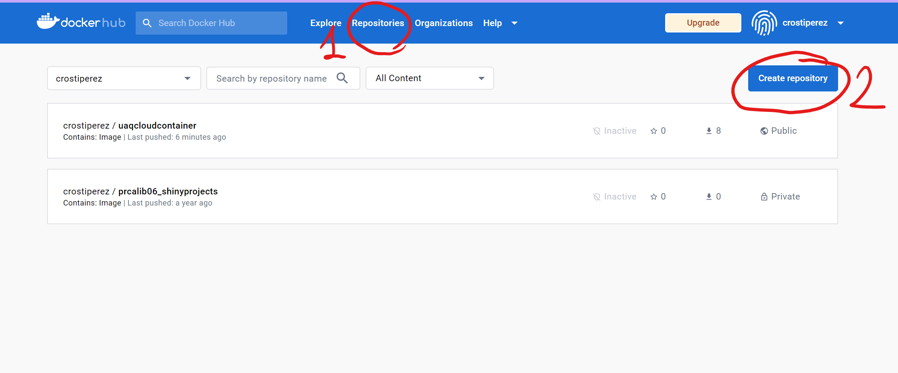
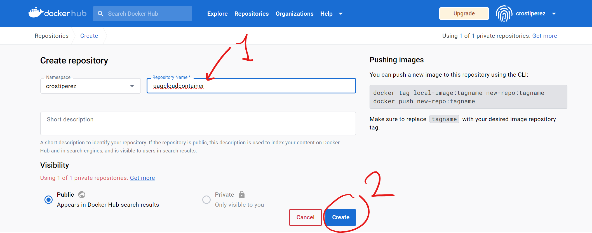
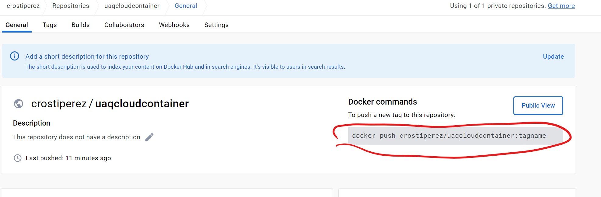

---
lab:
    title: 'Lab 04: Crear contenedor con Docker'
    module: 'Servicios de cómputo en la nube'
---

# Lab 04: Crear contenedor con Docker


## Abrir Cloud Shell desde el Portal de Azure y escoger la terminal Bash  y escribir los siguientes comandos

## Escribir los siguientes comandos
## Crear grupo de recursos
```Shell
az group create --name uaqCloud --location westus
```
## Crear VM
```Shell
az vm create \
  --resource-group uaqCloud \
  --name my-vm \
  --public-ip-sku Standard \
  --image Ubuntu2204 \
  --admin-username azureuser \
  --generate-ssh-keys
```
## Conectarse a VM
```Shell
ssh -i ~/.ssh/id_rsa azureuser@<su ip pública>
```

## Version Linux
```Shell
cat /etc/os-release
```

## Installar Docker
```Shell
sudo apt-get update
sudo apt-get install ca-certificates curl gnupg

sudo install -m 0755 -d /etc/apt/keyrings
curl -fsSL https://download.docker.com/linux/ubuntu/gpg | sudo gpg --dearmor -o /etc/apt/keyrings/docker.gpg
sudo chmod a+r /etc/apt/keyrings/docker.gpg

echo \
  "deb [arch="$(dpkg --print-architecture)" signed-by=/etc/apt/keyrings/docker.gpg] https://download.docker.com/linux/ubuntu \
  "$(. /etc/os-release && echo "$VERSION_CODENAME")" stable" | \
  sudo tee /etc/apt/sources.list.d/docker.list > /dev/null

sudo apt-get update

sudo apt-get install docker-ce docker-ce-cli containerd.io docker-buildx-plugin docker-compose-plugin
```

## Verificar que demon de docker está corriendo
```Shell
systemctl status docker
```
* Para salir del comando, presionar dos veces Ctrl + C 

## Crear carpeta llamada app
```Shell
mkdir app
```

## Entrar a la carpeta
```Shell
cd app
```

## Crear archivo llamado app
```Shell
touch app.py
```

## Entrar al archivo
```Shell
nano app
```

## Copiar y pegar dentro del archivo app
```Python
from flask import Flask
import os
import socket

app = Flask(__name__)

@app.route("/")
def hello():
        html = "<h3>Hello {name}!</h3> <b>Hostname:</b> {hostname}<br/>"
	return html.format(name=os.getenv("NAME", "word"), hostname = socket.gethostname())

@app.route("/hello/<name1>")
def hello_there(name1):
    now = datetime.now()
    formatted_now = now.strftime("%A, %d %B, %Y at %X")

    # Filter the name1 argument to letters only using regular expressions. URL arguments
    # can contain arbitrary text, so we restrict to safe characters only.
    match_object = re.match("[a-zA-Z]+", name1)

    if match_object:
        clean_name = match_object.group(0)
    else:
        clean_name = "Friend"

    content = "Hello there, " + clean_name + "! It's " + formatted_now
    return content

if __name__ == "__main__":
        app.run(host='0.0.0.0', port=80)
```

## Presionar las teclas siguientes para guardar y salir
Ctrl + S

Ctrl + X

## Crear archivo llamado Dockerfile
```Shell
touch Dockerfile
```

## Entrar al archivo
```Shell
nano Dockerfile
```

## Copiar y pegar dentro del archivo Dockerfile
```Dockerfile
From python:2.7-slim
WORKDIR /app
ADD . /app
RUN pip install --trusted-host pypi.python.org Flask
ENV NAME <su nombre>
CMD ["python", "app.py"]
```

## Presionar las teclas siguientes para guardar y salir
Ctrl + S

Ctrl + X

## Crear repositorio en Docker Hub




## Creamos el contenedor
```Shell
sudo docker build -t uaqcloudcontainer .
```

## Corremos el contenedor para verificar que el código esté bien
```Shell
sudo docker run --name webapp -p 80:80 uaqcloudcontainer
```

## Agregamos una etiqueta al contenedor
```Shell
sudo docker tag uaqcloudcontainer <su usuario docker>/uaqcloudcontainer:<su nombre>
```

## Iniciamos sesion en Docker Hub
```Shell
sudo docker login
```

## Pusheamos el contenedor a un repositorio público
```Shell
sudo docker push <su usuario docker>/uaqcloudcontainer:<su nombre>
```
## Al terminar de hacer push salir, tienes que salir de la máquina virtual con el siguiente comando
```Shell
exit
```

# Importante, borrar recursos al finalizar la práctica

```Shell
az group delete --name uaqCloud
```